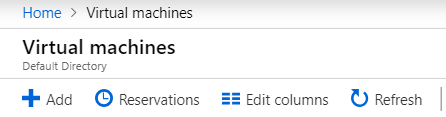
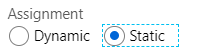
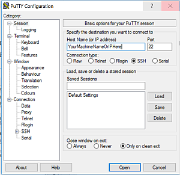
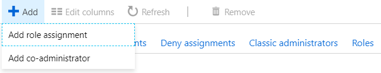
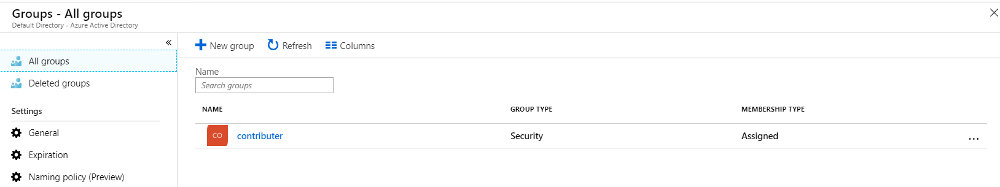
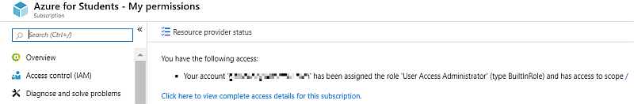

# Azure VM Management

| Andrew Garbe
| agarbe@iu.edu
| Indiana University
| hid: sp19-516-124
| github: [:cloud:](https://github.com/cloudmesh-community/sp19-516-124/edit/master/project-report/report.md)

## Abstract

Microsoft Azure is one of the leading cloud computing provides on the market today. 
With government, business and other organizations that have chosen this cloud computing technology, 
it would be unreasonable to think that any large-scale environment would be solely managed through 
the Azure portal GUI interface. 

The solution to effectively managing an Azure environment would occur through integration with technologies 
that make managing the Azure environment scalable and efficient.

## Introduction

The goal of this project is to interface with an Azure Virtual Machine using the Apache Libcloud Python 
library as well as the Microsoft CLI interface. To accomplish this goal a Micrsoft Azure environment 
will need to be configured and administrated in order to use the Apache Libcloud Python library and Azure CLI Interaface. 
This report will take you through the steps to configure the Azure enviroment as well as touching on 
the Apache Libcloud Python ASM and ARM libraries and Azure CLI Interaface. 
Last, you will find a follow up of observations and challenges encountered though the project and process.

## Requirements

* A computer where you have administrative rights to install applications.
* Python installed. (Version 3.7.2 at the time of this writing)
* Python IDE such as PyCharm
* Microsoft Azure Student Subscription

### Setup - Student Azure Portal
To start working in the Azure environment, 
you will to first need to set up an Azure Student Account. 
You can set up and activate an Azure student account at: <https://azure.microsoft.com/en-us/free/students/>. 

When you sign up for an Azure free account, you ontain a `Free Trial` subscription, 
which provides you $200 in Azure credits for 30 days and 12 months of free services. 
At the end of 12 months and 30 days, Azure disables your subscription. 
Your subscription is disabled to protect you from accidentally incurring charges for 
usage beyond the credit and free services included with your subscription. 
To continue using Azure services, 
you must upgrade your subscription to a `Pay-As-You-Go` subscription. 
After you upgrade, your subscription still has access to free services for 12 months. 
You only get charged for usage beyond the free services and quantities.

The Azure Student Account requires that you to activate the account after 30 days of use. 
If you do not activate, 
you will lose access to your Azure Student Account and can not use the services.

The Azure Student Account FAQ will likely answer questions you might have pertaining 
to an Azure Student Account, what you will have access to, how long you will enjoy access, 
as well as additional general overview information including terms of the account. 
<https://azure.microsoft.com/en-us/free/free-account-students-faq/>

Once you have set up the Azure Student account, you will gain access the Azure environment 
through the Azure Portal <https://portal.azure.com>. 
To log in, please use the credentials you determined during the set up.

### Create a Ubuntu Server 18.04 LTS Virtual Machine in Azure

In an effort to interact with an Azure Virtual Machine using Apache LibCloud, 
Azure SDK and/or Azure CLI, I have created a virtual machine for interaction. 
Here are the steps that I performed to create a Linux Ubuntu Server. 

To start, go to the Azure Portal: <https://portal.azure.com>.
Next, the locate the `Virtual Machines` option and select it:


Then create a new virtual machine by selecting `Add`:



This will present the configuration options needed to create a new virtual machine:


To configure a machine, choose from the following options:
#### Subscription: 
`Azure for Students` (default or chose from another available option.)

#### Resource Group: 
`CloudSevicetest` (Create new one if you do not have an available option.)

#### Virtual Machine Name: 
`virtualmachineName`

#### Region: 
`Central US` (default)

#### Availability Options: 
`No infrastructure redundancy required` (default)

#### Image: 
`Ubuntu Server 18.04 LTS`

#### Size: 
`Standard D2s v3, 2 vcpus, 8GB memory`

#### Authentication type: 
`password` (Choose a username and a password that meet the requirements or use SSH).

The configuration process has several available sections, the next section is `Disks`:


Choose the default or settings that match your needs. 
For the `OS disk type`, choose `Standard SSD` option.

For `Networking` choose the default configuration settings unless you would like to customize:


For `Management` choose the default configuration settings unless you would like to customize:


Last, create the virtual machine:


Once the new VM has been created, Naviagate back to the `Virtual machines` in the Azure Portal
and the Virtual Machine will be available for interaction:


After the creation of the virtual machine will be in a `running` status. 
Decide if you want your virtual machine in a `running` status, else stop the VM so that resources are not wasted. 

### Remote Access to the Virtual Machine 
To remote connect to a virtual machine, you can use a client application such as Putty:<https://www.putty.org/>.

To use Putty and access the virtual machine, you can use the virtual machine IP
or configure a DNS name in Azure.
This is performed in the Virtual Machine configuration under `DNS name`:


Click `Configure`.
Choose a `static` IP unless you do not mind the IP changing:



Then click `save`.

Note: If you have not configured the `port` that virtaul machine connection will occur, 
then connection will not be successful.

In the Virtual machine settings click `Connect` and review the connection settings.
Specify the port for example: `port 22`, that remote connection will be provisioned for:


To test connection to the virtual machine, launch the Putty client application and enter 
in the IP or the DNS name of the virtual machine:



The first time the environment is accessed Putty, Putty will prompt to cache your servers host key. 
Select `Yes` when prompted:


After the key is cached, next time you enter the Puttry client, you will be prompted to enter the 
server credentials (username\password) as specified in the virtual machine setup.

Once credentials are provided successfully, you will be logged into your virtual machine:
The following is an example of what you would expect to see logging into the terminal:

```
login as: <Username>
<machinename>.centralus.cloudapp.azure.com's password:
Welcome to Ubuntu 18.04.2 LTS (GNU/Linux 4.18.0-1014-azure x86_64)

 * Documentation:  https://help.ubuntu.com
 * Management:     https://landscape.canonical.com
 * Support:        https://ubuntu.com/advantage

  System information as of Fri Apr 19 13:32:51 UTC 2019

  System load:  0.8               Processes:           114
  Usage of /:   4.4% of 28.90GB   Users logged in:     0
  Memory usage: 57%               IP address for eth0: <MachineIP>
  Swap usage:   0%

 * Ubuntu's Kubernetes 1.14 distributions can bypass Docker and use containerd
   directly, see https://bit.ly/ubuntu-containerd or try it now with

     snap install microk8s --classic

  Get cloud support with Ubuntu Advantage Cloud Guest:
    http://www.ubuntu.com/business/services/cloud

 * Canonical Livepatch is available for installation.
   - Reduce system reboots and improve kernel security. Activate at:
     https://ubuntu.com/livepatch

30 packages can be updated.
0 updates are security updates.


Last login: Fri Apr 19 01:38:54 2019 from <IPAddress>
To run a command as administrator (user "root"), use "sudo <command>".
See "man sudo_root" for details.

<MachineName>:~$
```
 
## Apache Libcloud Azure ASM Compute Driver

Apache Libcloud is a Python library which hides differences between different cloud provider APIs 
and allows you to manage different cloud resources through a unified and easy to use API. 
For additional reference and/or more detail, you can read at 
<https://libcloud.readthedocs.io/en/latest/index.html>. 

The Azure ASM Compute Driver allows you to integrate with Microsoft Azure Virtual Machines service 
using the Azure Service Management (ASM) API. This is the `"Classic” API`, 
please note that it is incompatible with the newer Azure Resource Management (ARM) API, 
which is provided by the Azure ARM driver.

### Connecting to Azure
To connect to Azure, you need an Azure `Subscription ID` and `certificate file`.


#### Generating and uploading a certificate file and obtaining subscription ID
To be able to connect to the Azure environment with the Libcloud Azure ASM Compute Driver, 
generate a X.509 certificate which will be used for authentication.
After the certificate has been genrerated it will need to be uploaded to the Azure Management Portal.
On Linux, you can generate the certificate file using the commands shown below:

```bash
$  openssl req -x509 -nodes -days 365 -newkey rsa:2048 -keyout azure_cert.pem -out azure_cert.pem
$  openssl x509 -inform pem -in azure_cert.pem -outform der -out azure_cert.cer
```

This example demonstrates the use of a Windows 10 machine to work with the ASM Compute Driver 
in the PyCharm IDE.

To move files between the Azure Linux virtual machine and the local Windows 10 machine, 
you can use an application like WINSCP: <https://winscp.net/eng/index.php>. 
Move the "azure_cert.pem" file to a place that you want to access it when working with the 
ASM Driver in Python. For example, in the Linux virtual machines `/home` directory, 
locate the `azure_cert.pem` file, and download it to:  
`C:\Users\AUser\AnotherLocation\Project\azure_cert.pem`.

Certificates are used in Azure for cloud services service certificates and for authenticating with 
the management API management certificates. A certificate overview for Azure Cloud Service can be 
referenced at: 
<https://docs.microsoft.com/en-us/azure/cloud-services/cloud-services-certs-create>.

Once you have an available certificate, you will then need to upload the certificate to Azure. 
Information about this process can be located at: 
<https://docs.microsoft.com/en-us/azure/cloud-services/cloud-services-configure-ssl-certificate-portal>. 

Follow these steps to upload a certificate to Azure:

Connect to the Azure Portal and login: <https://portal.azure.com>
 
Connect to the `All services` option on the left side of the Azure Portal.
 


Under General section, locate the `Subscriptions` option:


Under Subscriptions, select a Subscription 
`Azure for Students`:


In the `Azure for Students` options, select 
`Management certificates`:


Next, select `Upload` to upload the certificate: 


Choose a subscription and provide the path to the .Cer Certifcate file, 
then select `Upload` to associate the certificate with the subscription:


Once uploaded, the certificate will show up in the `Azure for Students – Management certificates` section: 


Take note of the `SubscriptionID` associated with the certificate as this will be need to be 
referenced when instantiating the Libcloud Azure ASM Compute Driver.

Once a certificate has been created and configured within Azure, 
use the `Subscription ID` and `certificate file` to interact with the Libcloud ASM Driver. 
To do so, choose a Python IDE. 

This example was generating using Pycharm Edu.   

Following the `Azure ASM Compute Driver Documentation` at 
<https://libcloud.readthedocs.io/en/latest/compute/drivers/azure.html>.

Assuming a certificate file and subscriptionID have been provisioned, 
instantiate the driver as follows:

```
from libcloud.compute.types import Provider
from libcloud.compute.providers import get_driver

cls = get_driver(Provider.AZURE)
driver = cls(subscription_id='<SubscriptionIDGoesHere>',
             key_file='<Path to a certificate azure_cert.pem file>')
```

One instantiated, the driver is ready for use with the API methods listed in the documentation: <https://libcloud.readthedocs.io/en/latest/compute/drivers/azure.html> 

An example of a Libcloud ASM Driver integration to create a new Azure cloud service is as follows:


An example of Python code example to create an Azure cloud service named “e503CloudServicetest” 
would look like this:

```
#ex_create_cloud_service(name, location, description=None, extended_properties=None)
driver.ex_create_cloud_service('e503CloudServicetest', 'Central US', description=None, extended_properties=None)
```

Once the `ex_create_cloud_service` Python code has been executed, 
locate the new `e503CloudServicetest` cloud service in the Azure Portal under `All resources`:   


## Apache Libcloud Azure ARM Compute Driver

Apache Libcloud is a Python library which hides differences between different cloud provider APIs 
and allows you to manage different cloud resources through a unified and easy to use API. 
For additional reference and/or more detail, you can read at:  
<https://libcloud.readthedocs.io/en/latest/compute/drivers/azure_arm.html>. 

The Azure driver allows you to integrate with Microsoft Azure Virtual Machines provider using the 
Azure Resource Management (ARM) API. The Azure Virtual Machine service allows you to launch Windows 
and Linux virtual servers in many datacenters across the world.

To connect to Azure you need your `Tenant ID` and `Subscription ID`.

### Creating a Service Principal
The following directions are based on creating an azure Service Principal. 
This process can be performed using either Powershell or through the Azure Portal. 

 * PowerShell Service Principal creation: 
   The following supporting information and steps are used to create an Azure Service Principal using Windows PowerShell:
<https://azure.microsoft.com/en-us/documentation/articles/resource-group-authenticate-service-principal/>. 

 * Azure Portal Service Principal creation: 
   The following supporting information and steps are used to create an Azure Service Principal using the Azure Portal:
<https://docs.microsoft.com/en-us/azure/active-directory/develop/howto-create-service-principal-portal>.

Note: This process assumes that you have an active Azure Student Subscription.

The following steps demonstrate creating a new Azure Active Directory application and service principal
that can be used with the role-based access control. 
When you have code that needs to access or modify resources, you can create an identity for the app. 
This identity is known as a service principal. 
You can then assign the required permissions to the service principal. 

The follwoing steps will show you how to use the Azure Portal to create the service principal. 

The steps outline a single-tenant application where the application is intended to run within 
only one organization. You typically use single-tenant applications for line-of-business applications 
that run within your organization.

This is modifiyed to suit my project and has been derived from the following steps: 
<https://docs.microsoft.com/en-us/azure/active-directory/develop/howto-create-service-principal-portal>

First connect to the Azure Portal and login: <https://portal.azure.com>

Then select the Azure `Active Directory` option.

Choose `App Registrations` in the under the `Manage` section:


Next, select the `New application registration` option:


Provide a name and URL for the application. 

Select `Web app / API` for the type of application you want to create. 

Note: You cannot create credentials for a Native application. 
To read more about this you can access the following supporting information: 
<https://docs.microsoft.com/en-us/azure/active-directory/manage-apps/application-proxy-configure-native-client-application>.

After setting the values, select `Create` to create your Azure AD application and service principal.


The result of the app creation should resemble something close to the following:


### Assign the application to a role
To access resources in your subscription, you must assign the application to a role.
You can set the scope at the level of the subscription, resource group, or resource. 
Permissions are inherited to lower levels of scope. 
For example, adding an application to the Reader role for a resource group means it can read 
the resource group and any resources it contains.

Select the `All services` option.

Under the `General` section chose `Subscriptions`:


Choose the Subscription to assign the Application ID to. 
Example: `Azure for Students`: 


If you do not see the Subscription that you are looking for, 
select `global subscriptions` filter. 
Make sure the subscription you want is selected for the portal.

Select the `Access control (IAM)` option. 


Choose the `Add a Role Assignment option`:



To allow the application to execute actions like `reboot`, `start` and `stop` instances, 
select the `Contributor` role. 

By default, Azure AD applications are not displayed in the available options. 
To find your application, search for the name and select it. 

Select `Save` to finish assigning the role. 
You see your application in the list of users assigned to a role for that scope.



A service principal is now set up.

### Get values for signing in (Get Tenant ID)
When programmatically signing in, you need to pass the tenant ID with your authentication request.

Connect to the Azure Portal and login: <https://portal.azure.com>
Select the `Azure Active Directory Default Direcctory overview` select the `Properties` option.


Copy the `Directory ID` to get your `Tenant ID`.


### Get an Application ID and Authentication Key
You also need the ID for your application and an authentication key. 
To get those values, use the following steps:

Select App registrations in Azure AD, select your application:


Copy the `Application ID`so that you can store it in your application code.
Do this by choosing the application `Settings` and locating `Keys`, then selecting `Keys`.


Provide a description of the key, and a duration for the key. 
When done, select `Save`.

After saving the key, the value of the key is displayed. 

Copy this value because you are not able to retrieve the key later. 
You provide the key value with the application ID to sign in as the application. 
Store the key value where your application can retrieve it.

### Required permissions
You must have sufficient permissions to register an application with your Azure AD tenant and assign 
the application to a role in your Azure subscription.

To do so, first check your Azure Active Directory permissions.
Select the `Azure Active Directory` option.
Then select `User Settings` in the `Default Directory – Overview` section :


Next, check the App registrations setting. 

Note: This value can only be set by an administrator. 
If set to `Yes`, any user in the Azure AD tenant can register an app.


If the app registrations setting is set to `No`, 
only users with an administrator role may register these types of applications. 

See available roles:
<https://docs.microsoft.com/en-us/azure/active-directory/users-groups-roles/directory-assign-admin-roles#available-roles> 

And and role permissions: 
<https://docs.microsoft.com/en-us/azure/active-directory/users-groups-roles/directory-assign-admin-roles#role-permissions>.

To learn about available administrator roles and the specific permissions in Azure AD that 
are given to each role. 

If your account is assigned to the `User` role, 
but the app registration setting is limited to admin users, 
you will need an administrator to either assign you to one of the `administrator` roles 
that can create and manage all aspects of app registrations, or to enable users to register apps.

### Check Azure subscription permissions
In your Azure subscription, your account must have `Microsoft.Authorization/*/Write` 
access to assign an AD app to a role. 

This action is granted through the Owner role or User Access Administrator role. 

If your account is assigned to the `Contributor` role, you do not have adequate permission. 
You will receive an error when attempting to assign the service principal to a role.

To check your subscription permissions:
Select the `All services` option under the `General` section, 
Then choose `Subscriptions`:


Choose the Subscription to assign the Application ID to. 
Example: `Azure for Students`:


Under the `Azure for Students` section, locate the `My Permissions` option:


This will show your account permission. For Example:


View your assigned roles and determine if you have adequate permissions to assign 
an AD app to a role. 

If not, an administrator will need to add you to the `User Access Administrator` role. 
In the following image, the user is assigned to the `User Access Administrator` role,
which means that user has adequate permissions.

### Instantiating an Libcloud Azure ARM Compute Driver 

Use `<Application_Id>` for “key” and the `<Your_Password>` for “secret”.

Once you have the `tenant id`, `subscription id`, `application id (“key”)`, 
and `password (“secret”)`, you can create an AzureNodeDriver:


To interact with Azure VMs, You can pick from the available ARM methods.
For example, start a VM that is currently in a stopped state.

This would be accomplished with the `ex_start_node` method listed in the ARM driver documentation :


This is the Python code that was generated in order to test this method:
(Note: at the time of this writing this command did not return successfully)

```
from libcloud.compute.types import Provider
from libcloud.compute.providers import get_driver

cls = get_driver(Provider.AZURE_ARM)
driver = cls(tenant_id='<YourTenantIDHere>',
             subscription_id='<YourSubscriptionIDHere>',
             key='<YourKeyHere>',
             secret='<YourKeyHere>',
             region='centralus',
             )

#driver.ex_start_node()
driver.ex_start_node('TheNameOfMyLinuxVM')
```

## Microsoft Azure CLI

The Azure CLI is a command-line tool allows for interaction and management of Azure resources. 
The current version of the CLI is 2.0.63. For more information about releases please visit the following link:  <https://docs.microsoft.com/en-us/cli/azure/release-notes-azure-cli?view=azure-cli-latest>.

To find your installed version and see if you need to update, run `az --version`.

The following example is an installation and interaction on a Windows set up: 
<https://docs.microsoft.com/en-us/cli/azure/install-azure-cli-windows?view=azure-cli-latest>.

To find details about the Azure CLI setup on other machines here: 
<https://docs.microsoft.com/en-us/cli/azure/install-azure-cli?view=azure-cli-latest>. 

### Install or update
The MSI distributable is used for installing, updating, and uninstalling the az command on Windows.

To download the installed click on the following:


When the installer asks if it can make changes to your computer, 
click the `Yes` box.

You can now run the Azure CLI with the az command from either Windows Command Prompt 
or PowerShell. PowerShell offers some tab completion features not available from Windows Command Prompt. 
To sign in, run the az login command.

Once you have installed the CLI and have been able to successfully login, 
you can reference the following steps to interact with an Azure environment with the CLI tool:
<https://docs.microsoft.com/en-us/cli/azure/get-started-with-azure-cli?view=azure-cli-latest>.

### Sign in
Before using any CLI commands with a local install, you need to sign in with the command:
`az login`.

You may be directed and prompted to provide your credentials through a web browser if you are not 
currently actively logged in already. Once your credentials have been provided successfully, 
you will receive a message as follows:


The result should resemble:

```
Microsoft Windows [Version 10.0.17134.648]
(c) 2018 Microsoft Corporation. All rights reserved.

C:\WINDOWS\system32>az login
Note, we have launched a browser for you to login. For old experience with device code, use "az login --use-device-code"
You have logged in. Now let us find all the subscriptions to which you have access...
[
  {
    "cloudName": "<cloudnamehere>",
    "id": "<idHere>",
    "isDefault": true,
    "name": "Azure for Students",
    "state": "Enabled",
    "tenantId": "<tenantIDHere>",
    "user": {
      "name": "<NameHere>",
      "type": "user"
    }
  }
]

C:\WINDOWS\system32>
```

After logging in, you see a list of subscriptions associated with your Azure account. 
The subscription information with `isDefault: true` is the currently activated 
subscription after logging in. 

To select another subscription, use the `az account set` command with the subscription ID to switch to. 
For more information about subscription selection, see 
<https://docs.microsoft.com/en-us/cli/azure/manage-azure-subscriptions-azure-cli?view=azure-cli-latest>


#### Common commands
This following are some common commands used in the CLI:.

#### Resource group
`az group`

#### Virtual machines
`az vm`

#### Storage accounts
`az storage account`

#### Key Vault
`az keyvault`

#### Web applications
`az webapp`

#### SQL databases
`az sql server`

#### CosmosDB
`az cosmosdb`


### Finding commands
Commands in the CLI are organized as commands of groups. Each group represents an Azure service, 
and commands operate on that service.
To search for commands, use az find. For example, to search for command names containing secret, 
use the following command: 
`az find secret`:

```
C:\WINDOWS\system32>az find secret
I'm an AI bot (learn more: aka.ms/aladdinkb); Let me see how I can help you...

Here are the most common ways to use [secret]:

Get secret.
az lab secret show      --lab-name
                --name -n
                --resource-group -g
                --expand
                --subscription
Delete secret.
az lab secret delete    --lab-name
                --name -n
                --resource-group -g
                --subscription
Delete a secret.
az mesh secret delete   --name -n
                --resource-group -g
                --yes -y

C:\WINDOWS\system32>
```

Use the `—help` argument to get a complete list of commands and subgroups of a group. 
For example, to find the CLI commands for working with Network Security Groups (NSGs):
`az network ndg --help` :

```
C:\WINDOWS\system32>az network nsg --help

Group
    az network nsg : Manage Azure Network Security Groups (NSGs).
        You can control network traffic to resources in a virtual network using a network security
        group. A network security group contains a list of security rules that allow or deny inbound
        or outbound network traffic based on source or destination IP addresses, Application
        Security Groups, ports, and protocols. For more information visit
        https://docs.microsoft.com/en-us/azure/virtual-network/virtual-networks-create-nsg-arm-cli.

Subgroups:
    rule   : Manage network security group rules.

Commands:
    create : Create a network security group.
    delete : Delete a network security group.
    list   : List network security groups.
    show   : Get information about a network security group.
    update : Update a network security group.


C:\WINDOWS\system32>
```

The CLI has full tab completion for commands under the bash shell.

#### Globally available arguments
There are some arguments that are available for every command.
* `--help` prints CLI reference information about commands and their arguments and lists 
available subgroups and commands.

* `--output` changes the output format. The available output formats are json, jsonc (colorized JSON), 
tsv (Tab-Separated Values), table (human-readable ASCII tables), and yaml. 
By default the CLI outputs json. To learn more about the available output formats, 
see: <https://docs.microsoft.com/en-us/cli/azure/format-output-azure-cli?view=azure-cli-latest>

* `--query` uses the JMESPath query language to filter the output returned from Azure services. 
To learn more about queries, see 
<https://docs.microsoft.com/en-us/cli/azure/query-azure-cli?view=azure-cli-latest> 
and the `JMESPath tutorial` :<http://jmespath.org/tutorial.html>.

* `--verbose` prints information about resources created in Azure during an operation, 
and other useful information.

* `--debug` prints even more information about CLI operations, used for debugging purposes. 
If you find a bug, provide output generated with the --debug flag on when submitting a bug report.

#### Interactive mode
The CLI offers an interactive mode that automatically displays help information and makes it easier 
to select subcommands. You enter interactive mode with the az interactive command `az interactive`:

```
C:\WINDOWS\system32>az interactive
az>> C:\Users\Andrew.garbe\.azure\cliextensions\interactive\azext_interactive\azclishell\_dump_commands.py:136: YAMLLoadWarning: calling yaml.load() without Loader=... is deprecated, as the default Loader is unsafe. Please read https://msg.pyyaml.org/load for full details.
  help_entry = yaml.load(help_yaml)


-----------------------------------------------------------------------------------------
                                            *
-----------------------------------------------------------------------------------------

-----------------------------------------------------------------------------------------
#[cmd]                      : use commands outside the application
[cmd] + [param] +"??[query]": Inject jmespath query from previous command
"??[query]"                 : Jmespath query of the previous command
[cmd] :: [num]              : do a step by step tutorial of example
$                           : get the exit code of the previous command
%%[cmd]                     : set a scope, and scopes can be chained with spaces
%% ..                       : go back a scope

oading...                                                         Hit [enter] to refresh
```

For more information on interactive mode, 
see Azure CLI Interactive Mode: 
<https://docs.microsoft.com/en-us/cli/azure/interactive-azure-cli?view=azure-cli-latest?>

#### Learn CLI basics with quickstarts and tutorials
To get you started with the Azure CLI, try an in-depth tutorial for setting up virtual machines 
and using the power of the CLI to query Azure resources.

You can access the tutorial material at the following link:
<https://docs.microsoft.com/en-us/cli/azure/azure-cli-vm-tutorial?view=azure-cli-latest>

There are also quickstarts for other popular services.
* Create a storage account using the Azure CLI
* Transfer objects to/from Azure Blob storage using the CLI
* Create a single Azure SQL database using the Azure CLI
* Create an Azure Database for MySQL server using the Azure CLI
* Create an Azure Database for PostgreSQL using the Azure CLI
* Create a Python web app in Azure
* Run a custom Docker Hub image in Azure Web Apps for Containers


## Conclusion

With the stated goal of this project being to interface with an Azure Virtual Machine 
using the Apache Libcloud Python library as well as the Microsoft CLI interface, 
there has been succees and challenges.

As Illustrated above, a Microsoft Azure environment has been successfully provisioned 
to admnistrator in order to interface with the Apache Libcloud ASM Driver and Azure CLI interface.

This process alone was a considerable effort and project to accomplish into a series of repeatable steps 
as outlined in this writing.

Unforseen challenges encountered in this project were:
* Inconsistent functionablity with the Libcloud ASM and ARM drivers preventing expected behavior.
* Limited documentation and examples to interact with the Libcloud ASM and ARM drivers.

The Microsoft Azure CLI was the easiest and best documented interface between all 3 choices that I reviewed.

In conclusion this was a challenging and rewarding project with minor successful outcome.


