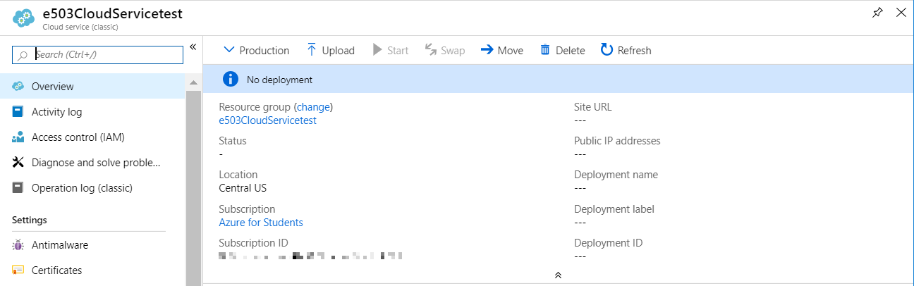
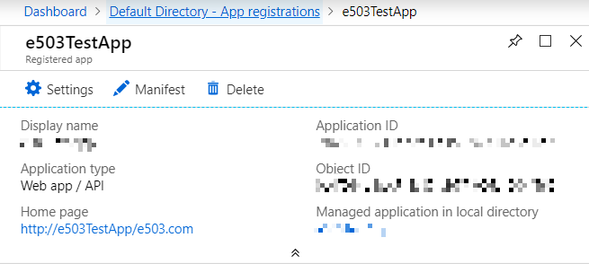

# Azure VM Management


| Andrew Garbe
| agarbe@iu.edu
| Indiana University
| hid: sp19-516-124
| github: [:cloud:](https://github.com/cloudmesh-community/sp19-516-124/edit/master/project-report/report.md)

## Abstract

TBD

## Introduction

TBD

## Requirements

TBD

### Setup - Student Azure Portal
To start working in the Azure environment, you will to first need to set up an Azure Student Account. 
You can set up and activate an Azure student account at <https://azure.microsoft.com/en-us/free/students/>. 

When you sign up for an Azure free account, you get a Free Trial subscription, which provides you $200 in Azure credits for 30 days and 12 months of free services. At the end of 30 days, Azure disables your subscription. Your subscription is disabled to protect you from accidentally incurring charges for usage beyond the credit and free services included with your subscription. To continue using Azure services, you must upgrade your subscription to a Pay-As-You-Go subscription. After you upgrade, your subscription still has access to free services for 12 months. You only get charged for usage beyond the free services and quantities.

The Azure Student Account requires that you to activate the account after 30 days of use. 
If you do not activate, you will loose access to your Azure Student Account and can not use the services.

The Azure student account FAQ will likely answer questions you might have pertaining to an Azure Student Account, what you will have access to, how long you will enjoy access, and additional general overview information including terms of the account. <https://azure.microsoft.com/en-us/free/free-account-students-faq/>

Once you have set up the Azure Student account, you will gain access the Azure environment through the Azure Portal <https://portal.azure.com>. To log in, please use the credentials you determined during the set up.

### Create a Ubuntu Server 18.04 LTS Virtual Machine in Azure

TBD
 
## Apache Libcloud Azure ASM Compute Driver

TBD

Apache Libcloud is a Python library which hides differences between different cloud provider APIs and allows you to manage different cloud resources through a unified and easy to use API. For additional reference and/or more detail, you can read at <https://libcloud.readthedocs.io/en/latest/index.html>. 
The Azure ASM Compute Driver allows you to integrate with Microsoft Azure Virtual Machines service using the Azure Service Management (ASM) API. This is the “Classic” API, please note that it is incompatible with the newer Azure Resource Management (ARM) API, which is provided by the azure arm driver.

### Connecting to Azure
To connect to Azure, you need your subscription ID and certificate file.

#### Generating and uploading a certificate file and obtaining subscription ID
To be able to connect to the Azure, you need to generate a X.509 certificate which is used to authenticate yourself and upload it to the Azure Management Portal.
On Linux, you can generate the certificate file using the commands shown below:

```bash
$  openssl req -x509 -nodes -days 365 -newkey rsa:2048 -keyout azure_cert.pem -out azure_cert.pem
$  openssl x509 -inform pem -in azure_cert.pem -outform der -out azure_cert.cer
```

Since I am using Windows 10 to work with the ASM Compute Driver in PyCharm,
I used the WINSCP application to connect to my Linux machine so that I can copy the "azure_cert.pem" certificate that was generated in my Linux `/home` directory to any location of my choosing on my Windows 10 machines file system. An example would be `C:\Users\Andrew.garbe\Downloads\2019 Spring Data Science\Project\azure_cert.pem`.

Certificates are used in Azure for cloud services service certificates and for authenticating with the management API management certificates.
A certificate overview for Azure Cloud Service can be referenced at: <https://docs.microsoft.com/en-us/azure/cloud-services/cloud-services-certs-create>.

Once you have an available certificate, you will then need to upload the certificate to Azure. Information about this process can be located at <https://docs.microsoft.com/en-us/azure/cloud-services/cloud-services-configure-ssl-certificate-portal>. 
The steps I used are as follows:

 Connect to the Azure Portal and login: <https://portal.azure.com>
 
 Connect to the `All services` option on the left side of the Azure Portal.
 


Under General section, locate the `Subscriptions` option:


Under subscriptions, select the subscription `Azure for Students`:


In the `Azure for Students` options select `Management certificates`:


Next, select `Upload` to upload your certificate: 


Choose a subscription and provide the path to the .Cer Certifcate file, then select `Upload` to associate the certificate with your subscription:


Once uploaded, the certificate will show up in the `Azure for Students – Management certificates` section: 


Take note of the `subscriptionID` associated with the certificate as this will be need to be referenced when instantiating the Libcloud Azure ASM Compute Driver.

You should now have a certificate associated with an Azure subscription.


Now that you have a certificate you are ready to interact with the Libcloud Azure ASM Compute Driver. To do so, you will need to open a Python IDE. For purposes of this class I am using Pycharm Edu.   

Following the `Azure ASM Compute Driver Documentation` at <https://libcloud.readthedocs.io/en/latest/compute/drivers/azure.html>, once you have generated the certificate file and obtained your subscriptionID, you can instantiate the driver as follows:

```
from libcloud.compute.types import Provider
from libcloud.compute.providers import get_driver

cls = get_driver(Provider.AZURE)
driver = cls(subscription_id='<SubscriptionIDGoesHere>',
             key_file='<Path to a certificate azure_cert.pem file>')
```

One instantiated, the driver is ready for use with the API methods listed in the documentation: <https://libcloud.readthedocs.io/en/latest/compute/drivers/azure.html> 

An example of an Integration that I have had success with is creating an Azure cloud service:


An example of Python code example of creating a Azure cloud service named “e503CloudServicetest” would look like this:

```
#ex_create_cloud_service(name, location, description=None, extended_properties=None)
driver.ex_create_cloud_service('e503CloudServicetest', 'Central US', description=None, extended_properties=None)
```

Once the `ex_create_cloud_service` Python code has been executed, I am now able to the `e503CloudServicetest` cloud service in the Azure Portal under `All resources`:   




## Apache Libcloud Azure ARM Compute Driver

TBD

Apache Libcloud is a Python library which hides differences between different cloud provider APIs and allows you to manage different cloud resources through a unified and easy to use API. For additional reference and/or more detail, you can read at https://libcloud.readthedocs.io/en/latest/compute/drivers/azure_arm.html. 

The Azure driver allows you to integrate with Microsoft Azure Virtual Machines provider using the Azure Resource Management (ARM) API. Azure Virtual Machine service allows you to launch Windows and Linux virtual servers in many datacenters across the world. To connect to Azure you need your tenant ID and subscription ID.

### Creating a Service Principal
The following directions are based on creating an azure Service Principal. This process can be performed using either Powershell or    through the Azure Portal. 

 * PowerShell Service Principal creation: 
   The following supporting information and steps are used to create an Azure Service Principal using Windows PowerShell:
<https://azure.microsoft.com/en-us/documentation/articles/resource-group-authenticate-service-principal/>. 

 * Azure Portal Service Principal creation: 
   The following supporting information and steps are used to create an Azure Service Principal using the Azure Portal:
<https://docs.microsoft.com/en-us/azure/active-directory/develop/howto-create-service-principal-portal>.

Note: This process assumes that you have an active Azure Student Subscription.

The following steps show you how to create a new Azure Active Directory application and service principal that can be used with the role-based access control. 
When you have code that needs to access or modify resources, you can create an identity for the app. This identity is known as a service principal. 
You can then assign the required permissions to the service principal. 

The follwoing steps will show you how to use the Azure Portal to create the service principal. 
The steps outline a single-tenant application where the application is intended to run within only one organization. 
You typically use single-tenant applications for line-of-business applications that run within your organization.
This is modifiyed to suit my project and has been derived from the following steps: <https://docs.microsoft.com/en-us/azure/active-directory/develop/howto-create-service-principal-portal>

First connect to the Azure Portal and login: <https://portal.azure.com>
Then select the Azure `Active Directory` option.
Choose `App Registrations` in the under the `Manage` section:


Next, select the `New application registration` option:


Provide a name and URL for the application. I made up a fake URL for my app. 

Next, select `Web app / API` for the type of application you want to create. 
Note: You cannot create credentials for a Native application. 
To read more about this you can access the following supporting information: <https://docs.microsoft.com/en-us/azure/active-directory/manage-apps/application-proxy-configure-native-client-application>.

After setting the values, select `Create` to create your Azure AD application and service principal.


The result of the app creation should resemble something close to the following:



### Assign the application to a role
To access resources in your subscription, you must assign the application to a role.
You can set the scope at the level of the subscription, resource group, or resource. Permissions are inherited to lower levels of scope. For example, adding an application to the Reader role for a resource group means it can read the resource group and any resources it contains.

Next select the `All services` option.
Under the `General` section chose `Subscriptions`:


Chose the Subscription to assign the Application ID to. For example, my Subscrition is `Azure for Students`: 


If you do not see the Subscription  that you are looking for, select `global subscriptions` filter. 
Make sure the subscription you want is selected for the portal.

Select the `Access control (IAM)` option. 


Choose the `Add a Role Assignment option`:


To allow the application to execute actions like `reboot`, `start` and `stop` instances, select the `Contributor` role. 

By default, Azure AD applications are not displayed in the available options. To find your application, search for the name and select it. 

Select `Save` to finish assigning the role. 
You see your application in the list of users assigned to a role for that scope.


A service principal is now set up.

### Get values for signing in (Get Tenant ID)
When programmatically signing in, you need to pass the tenant ID with your authentication request.

Connect to the Azure Portal and login: <https://portal.azure.com>
Select the `Azure Active Directory Default Direcctory overview` select the `Properties` option.


Copy the `Directory ID` to get your `Tenant ID`.


### Get an Application ID and Authentication Key
You also need the ID for your application and an authentication key. 
To get those values, use the following steps:

Select App registrations in Azure AD, select your application:


Copy the `Application ID`so that you can store it in your application code.
Do this by choosing the application `Settings` and locating `Keys`, then selecting `Keys`.


Provide a description of the key, and a duration for the key. When done, select `Save`.
After saving the key, the value of the key is displayed. 

Copy this value because you are not able to retrieve the key later. You provide the key value with the application ID to sign in as the application. Store the key value where your application can retrieve it.


TBD

## Microsoft Azure CLI

TBD

## Azure SDK for Python

TBD

## Conclusion

TBD

## Acknowledgement

TBD
